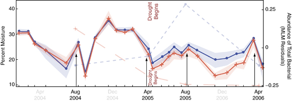
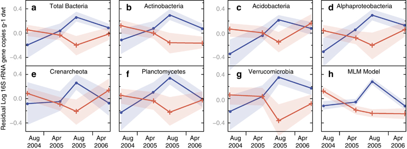
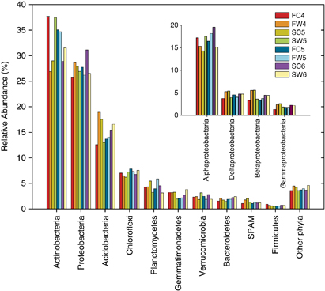

Welcome to the code repository for the [article](http://www.nature.com/ismej/journal/v5/n10/full/ismej201132a.html):
 
# <cite>Effect of warming and drought on grassland microbial communities</cite>

TODO: add Zenodo DOI

[Cody S Sheik](http://www.d.umn.edu/llo/people/csheik.html)1,2, [William Howard Beasley](https://scholar.google.com/citations?user=ffsJTC0AAAAJ&hl=en)3, [Mostafa S Elshahed](https://microbiology.okstate.edu/faculty/mostafa/elshahed.html)4, [Xuhui Zhou](http://ecolab.ou.edu/?member_info&id=3)1, [Yiqi Luo](http://ecolab.ou.edu/?member_info&id=52)1 and [Lee R Krumholz](http://mpbio.ou.edu/lee-krumholz)1,2.

*Organizations*:

1. Department of Botany and Microbiology, University of Oklahoma, Norman, OK, USA
2. The Institute for Energy and the Environment, University of Oklahoma, Norman, OK, USA
3. Department of Psychology, University of Oklahoma, Norman, OK, USA
4. Department of Microbiology and Molecular Genetics, Oklahoma State University, Stillwater, OK, USA

(Notes: Cody Sheik is now an Assistant Professor of Biology at [University of Minnesota, Duluth](http://www.d.umn.edu/biology/).  Will Beasley is now an Assistant Professor of Research at OUHSC Pediatrics, in the [BBMC](http://www.ouhsc.edu/bbmc/) and President of [Howard Live Oak](http://howardliveoak.com/), LLC)

Correspondence: LR Krumholz, Department of Botany and Microbiology, University of Oklahoma, 770 Van Vleet Oval, Norman, OK 73019, USA. E-mail: krumholz@ou.edu.  Received 2010-09-23; Revised 2011-02-08; Accepted 2011-02-21; Published online 2011-03-31.

# Article Abstract
> The soil microbiome is responsible for mediating key ecological processes; however, little is known about its sensitivity to climate change. Observed increases in global temperatures and alteration to rainfall patterns, due to anthropogenic release of greenhouse gases, will likely have a strong influence on soil microbial communities and ultimately the ecosystem services they provide. Therefore, it is vital to understand how soil microbial communities will respond to future climate change scenarios. To this end, we surveyed the abundance, diversity and structure of microbial communities over a 2-year period from a long-term in situ warming experiment that experienced a moderate natural drought. We found the warming treatment and soil water budgets strongly influence bacterial population size and diversity. In normal precipitation years, the warming treatment significantly increased microbial population size 40-150% but decreased diversity and significantly changed the composition of the community when compared with the unwarmed controls. However during drought conditions, the warming treatment significantly reduced soil moisture thereby creating unfavorable growth conditions that led to a 50-80% reduction in the microbial population size when compared with the control. Warmed plots also saw an increase in species richness, diversity and evenness; however, community composition was unaffected suggesting that few phylotypes may be active under these stressful conditions. Our results indicate that under warmed conditions, ecosystem water budget regulates the abundance and diversity of microbial populations and that rainfall timing is critical at the onset of drought for sustaining microbial populations.
>
> Keywords: climate change; microbial diversity; drought; warming

# Selected Figures from Manuscript

### Figure 1

Average soil moisture taken at 10???cm over the 2-year sampling period. Solid lines represent warm (plus sign) and control (circles) treatments while grey bands represent the standard deviation associated with each time point. Dashed lines represent the total microbial community modeled abundance from the Multi-Level Modeling (MLM). Arrows represent dates at which samples were taken.

### Figure 2

Residual plots of qPCR generated 16S rRNA gene abundance data over time for warmed (plus sign) and control (circles) plots. Residual plots of total bacteria (a) and individual phyla (b???g) were generated using the baseline average for each plot across all four seasons. The shaded bands depict the standard deviation. (h) Bayesian MLM takes into account all microbial groups assayed and grey bands represent the bootstrapped 95% confidence intervals. Raw values are in Supplementary Table 2.

### Figure 3

Relative abundance of dominant bacterial phyla in pyrosequencing generated 16S rRNA genes sequence libraries at the KFFL warming site. Each bar is color-coded and represents a single sampling time. Abundance was normalized by treatment and time. Abundance of Proteobacteria is included in the subset. F(C/W)4=August 2004, S(C/W)=April 2005, F(C/W)5=August 2005, S(C/W)6=April 2006; C=control, W=warmed.

# Reproducible Research
When the repository is installed on your local machine, and the [R](http://cran.rstudio.com/) software is installed, the [`reproduce.R`](./utility/reproduce.R) script starts with our [initial datasets](./data/raw) to create the derivative datasets and [resulting graphs and analysis](./analysis).

# Directories
TODO: insert directories

# Code Repository
The analysis is written primarily in R, under the GPL-2 License.  <!--The DOI of the *repository* (not of the article) is [10.5281/zenodo.12212](https://zenodo.org/record/12212).-->
